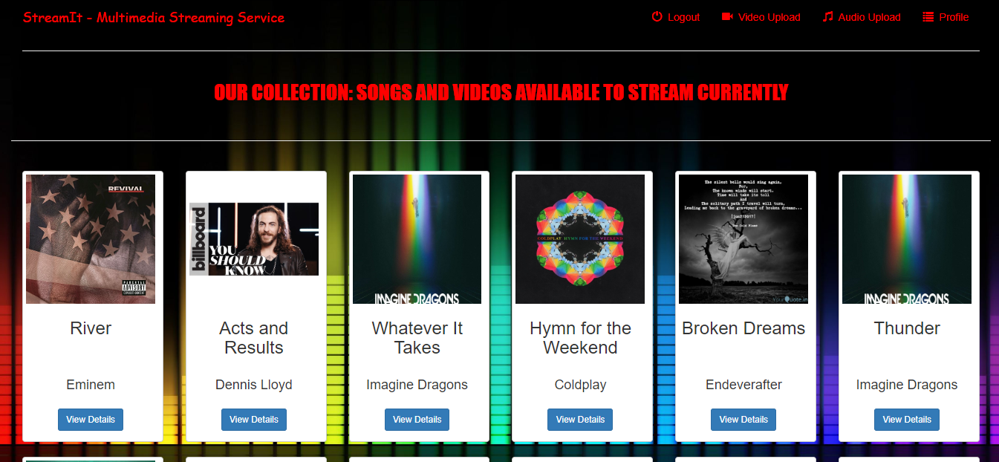

# StreamItV2
Multimedia Streaming &amp; Sharing Platform developed using Django=2.1.2

## Installation
- Clone this repository: `git clone https://www.github.com/SiddAjriY2Jaccount/StreamItV2`
- Install requirements (preferably in a virtualenv): `pip install -r requirements.txt`
- Start the server: `python manage.py runserver`
- On your browser, navigate to: `localhost:8000`
